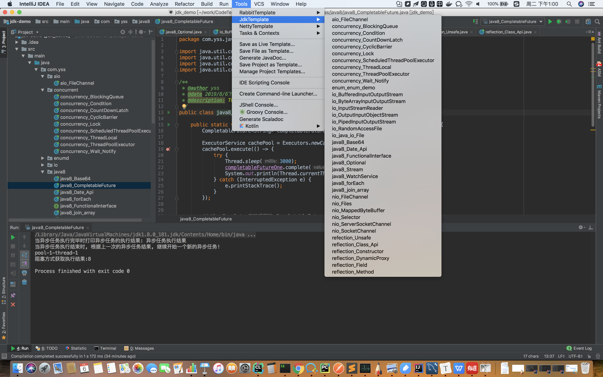

-  本项⽬源于Java项⽬中模板代码太多，例如java nio、反射、concurrent包、netty的服务端等写法
  ⾮常的固定⽽繁琐。本⼈希望IDEA能⾃动⽣成模板代码，在此基础上进⾏简单修改即可使⽤。⽬
  前包含了jdk、kafka、netty、rabbitMq四⼤类60个模板。

  

- 安装完成后在Tools菜单下，会出现三个子菜单，分别对应着三大分类，点击下级子菜单即可使用。

